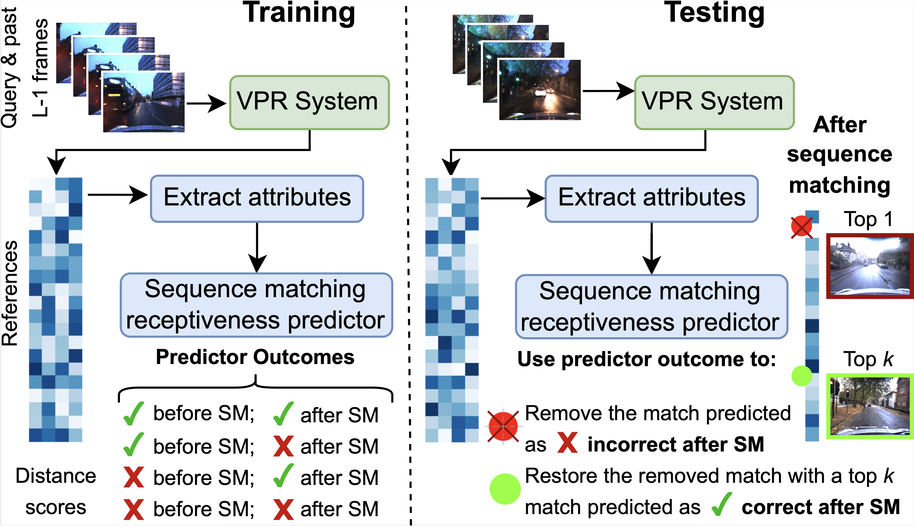

# Improving Visual Place Recognition with Sequence-Matching Receptiveness Prediction


[](https://creativecommons.org/licenses/by-nc-sa/4.0/)
[](https://github.com/QVPR/vpr-smr-predictor/stargazers)
[](https://qcr.ai)
[](https://pixi.sh)
[](./README.md)


Code for our IEEE/RSJ IROS 2025 paper "Improving Visual Place Recognition with Sequence-Matching Receptiveness Prediction".



> **Paper:** *Improving Visual Place Recognition with Sequence-Matching Receptiveness Prediction*  
> **Authors:** Somayeh Hussaini, Tobias Fischer, Michael Milford

> 📄 **Arxiv paper link:** https://arxiv.org/abs/2503.06840

> ▶️ **YouTube video**: https://www.youtube.com/watch?v=7hxKFQ0ORR4

---

## Overview
This repository contains the source code accompanying our paper on **Sequence Matching Receptiveness (SMR) prediction** for Visual Place Recognition (VPR). The core idea is simple: sequence matching can help VPR, but not always. We train a predictor that estimates, **per frame**, whether sequence matching is likely to help or not and we use that to remove matches that are predicted as incorrect after sequence matching and potentially replacing them with another top k match that is predicted as correct. Our approach is agnostic to the underlying VPR technique and improves performance across a range of models and datasets.

We provide:
- Training and evaluation code for the SMR predictor.
- Ready to use base configurations (sequence length specific) for **3 datasets** and **7 VPR models** via `configs.sh`.
- Utilities for plotting and analysis.

---

## Citation
If you find this work useful, please cite:

**Plain text**
```
Hussaini, Somayeh, Tobias Fischer, and Michael Milford. "Improving Visual Place Recognition with Sequence-Matching Receptiveness Prediction." arXiv preprint arXiv:2503.06840 (2025)
```

**BibTeX** *(Presented at IEEE/RSJ IROS2025, citation to be updated)*
```bibtex
@article{hussaini2025improving,
  title={Improving Visual Place Recognition with Sequence-Matching Receptiveness Prediction},
  author={Hussaini, Somayeh and Fischer, Tobias and Milford, Michael},
  journal={arXiv preprint arXiv:2503.06840},
  year={2025}
}
```

---


## Installation
We provide installation guidelines for both **Pixi** and **Conda/Mamba** workflows.

### Option A Pixi (recommended)
1. Pixi is an easy-to-use and fast and reproducible package manager. If you don't already have pixi installed, please follow the instructions from their website [here](https://pixi.sh/latest/installation/).  
2. From the repo root:
   ```bash
   # Create the environment defined in pixi.toml
   pixi install -e vprsm

   # Activate the environment
   pixi shell -e vprsm
   ```

### Option B Conda/Mamba

```bash
# micromamba (recommended) creates an environment similar to pixi

micromamba create -n vprsm -c conda-forge python>=3.12 pytorch-gpu opencv scikit-image scikit-learn seaborn pandas cuda-compiler faiss-gpu imbalanced-learn ipykernel natsort tabulate

micromamba activate vprsm
```

> If you prefer `conda` or `mamba`, replace `micromamba` with your tool of choice.

---

## Data Preparation (VPR Features)
This code assumes you have **pre-extracted VPR descriptors** for the datasets you plan to use. Store features under the below folder structure, e.g.:
```
<parent_directory>
├── vpr-smr-predictor/
│ ├── output/
│ └── ...
├── VPR-methods-evaluation/logs/default/
│ ├── {model_name}_{dataset_name}_{ref_name}_{qry_name}_{num_places}
│ └── ...
```

- **Feature extraction tools**: For most models we used the [**VPR-methods-evaluation**](https://github.com/gmberton/VPR-methods-evaluation) repository. For a few models, we used **the original authors' code**.

---

## Running the Code
The main entry points are:
- `train.py` trains the SMR predictor.
- `test.py` runs inference and aggregates metrics.

### Training the SMR predictor
Example (adjust paths/names for your setup):

```bash
pixi run python3 train.py --dataset_name SFU-Mountain --ref dry --qry dusk --num_places 385 --seq_len 4
```

### Testing the SMR predictor on a separate segment of the data
```bash
pixi run python3 test.py --model_name NetVLAD --model_type pittsburgh --dataset_name SFU-Mountain --ref dry --qry dusk --num_places 385 --seq_len 4
```

---

## Configurations
We provide base configurations (for a **specific sequence length**) covering **3 datasets** (Nordland, Oxford RobotCar, SFU Mountain) and **7 VPR models** (CosPlace, MixVPR, EigenPlaces, SALAD, AP-GeM, NetVLAD, SAD) in:
```
./configs.sh
```
Use these as starting points and adapt to your filesystem and experimental needs.

---

## License
This project is licensed under [MIT License](LICENSE).

---

## Acknowledgements
These works were supported by the Australian Government and the Queensland University of Technology (QUT) through the Centre for Robotics.


